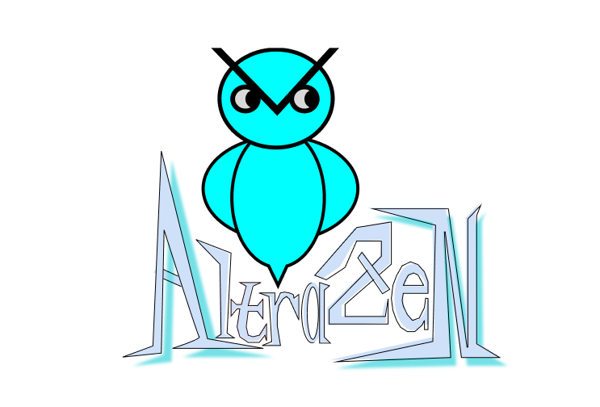

<!-- PROJECT LOGO -->
 

  

<h3 align="center">Fresher</h3>

  

    Bla Bla
     
    <a href="https://github.com/rafeuddaraj/Fresher"><strong>Explore the docs »</strong></a>
     
     
    <!-- <a href="https://vidiquiz.altrazen.com/">View Demo</a> -->
    ·
    <a href="https://github.com/rafeuddaraj/Fresher/issues">Report Bug</a>
    ·
    <a href="https://github.com/rafeuddaraj/Fresher/issues">Request Feature</a>
  

<!-- TABLE OF CONTENTS -->

<!-- ABOUT THE PROJECT -->

## Quick View

  

## Getting Started

### Prerequisites

### Installation
